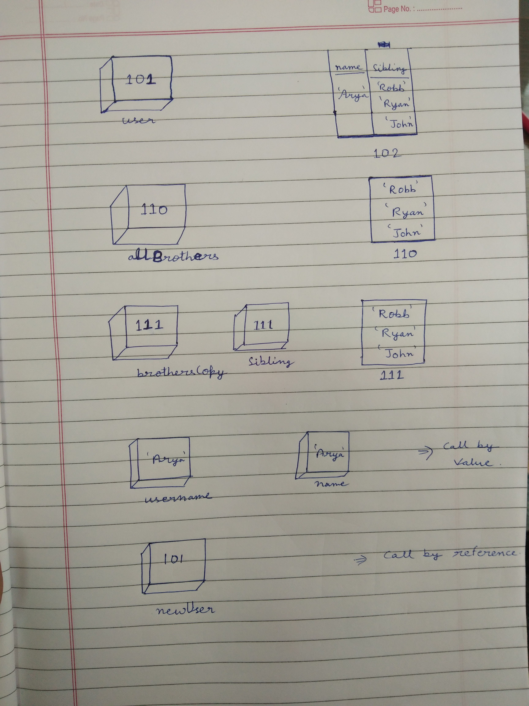

```js
let user = {
  name: 'Arya',
  sibling: ['Robb', 'Ryan', 'John'],
};
let allBrothers = ['Robb', 'Ryan', 'John'];
let brothersCopy = user.sibling;
let usename = user.name;
let newUser = user;

```

1. Memory representation

- Create the memory representation of the above snippet on notebook.
- Take a photo/screenshot and add it to the folder `code`

<!-- To add this image here use  -->


2. Answer the following with reason:

- `user == newUser;` // output and reason  true here reference of user is assigned to newUser;
- `user === newUser;`// true both have same reference
- `user.name === newUser.name;` // true both are referring to same address.
- `user.name == newUser.name;`//true both are referring to same address.
- `user.sibling == newUser.sibling;`//user.sibling == newUser.sibling
- `user.sibling === newUser.sibling;`//user.sibling == newUser.sibling
- `user.sibling == allBrothers;` // false both are reffering to different address.
- `user.sibling === allBrothers;` //false both are reffering to different address.
- `brothersCopy === allBrothers;` // false both are reffering to different address.
- `brothersCopy == allBrothers;` // false both are reffering to different address.
- `brothersCopy == user.sibling;`  // true both are reffering to same address.
- `brothersCopy === user.sibling;` // true both are reffering to same address.
- `brothersCopy[0] === user.sibling[0];` // true both have same value
- `brothersCopy[1] === user.sibling[1];` // true both have same address value
- `user.sibling[1] === newUser.sibling[1];` // true both have same address value
